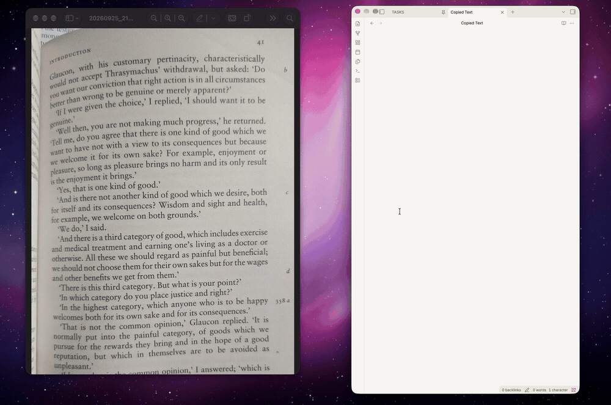

<div align="center">
  

  <h1>Word Snip</h1>

  <p>because my girlfriend asked for it...</p>
  <p>
    <a href="https://github.com/Ajtn05/Word-Snip/releases/tag/v1.4.0"></a>
    <a href="https://github.com/Ajtn05/Word-Snip/releases/download/v1.4.0/Word-Snip-v1.4-macOS.zip"></a>
    
    
  </p>

  <p><strong>Copy text from anywhere on your Mac with a rectangle or freehand selection.</strong></p>
  <p>Select an area of your screen. Word Snip recognizes the text with Apple Vision and copies it to your clipboard.</p>
</div>

## Demo

[](assets/word-snip-demo.mp4)

[Watch the full demo](assets/word-snip-demo.mp4).

## Capture text from your screen

1. Press **⌃⇧2** to select a rectangle, or **⌃⇧3** to draw a freehand outline. You can change either shortcut in Settings.
2. Drag around the text you want. The freehand outline closes when you release the mouse; text outside it is excluded.
3. Paste the recognized text anywhere. Press **Esc** to cancel a selection.

Word Snip can launch at login and has an optional menu bar icon. Its menu includes both capture modes. **⌃⌥,** opens Settings even when the icon is hidden.

In Settings, turn on **Single-line text** to copy OCR results as one continuous line. It replaces line breaks and repeated whitespace with single spaces, making the text easier to paste into a document.

To set either capture shortcut, open Settings, click its current shortcut, then press a key with **Command**, **Control**, or **Option**. Press **Esc** to cancel recording. If another app or the other capture mode already uses that combination, Word Snip keeps your previous shortcut.

## Download and install

Word Snip runs on Apple silicon and Intel Macs with macOS 14 or newer.

1. [Download Word Snip 1.4 for macOS](https://github.com/Ajtn05/Word-Snip/releases/download/v1.4.0/Word-Snip-v1.4-macOS.zip).
2. Open the downloaded ZIP file, then drag `Word Snip.app` into your **Applications** folder.
3. Open **Word Snip** from **Applications**.

**If macOS blocks the app:** This build is development signed and not notarized. After trying to open it, go to **System Settings → Privacy & Security**, click **Open Anyway** for Word Snip, and confirm that you want to open it. Only do this if you trust the download.

**When asked for screen access:** Allow **Screen & System Audio Recording**. Then fully quit Word Snip and open it again so the permission takes effect.

## Build and test from source

Requires macOS 14 or newer, Xcode, [XcodeGen](https://github.com/yonaskolb/XcodeGen), and an Apple Development signing identity. For a first build, set `WORD_SNIP_DEVELOPMENT_TEAM` to the certificate's team ID. The test script reuses the team ID from an existing signed test app on later builds. Set `WORD_SNIP_SIGNING_IDENTITY` to choose a specific identity if needed.

```sh
xcodegen generate
./scripts/test-app.sh run
```

The script builds and runs the signed development copy at `build/testing/Word Snip Testing.app`. Its name and bundle identifier differ from the release app, so each has its own Screen Recording permission. The test app stays at that path across rebuilds; grant permission to **Word Snip Testing** once, then fully quit and reopen it. Use `./scripts/test-app.sh build` to build without launching, `check` to verify the bundle, or `stop` to close it.

To test a capture, run the script, then use **⌃⇧2** for a rectangle and **⌃⇧3** for a freehand outline. Check that the copied text pastes correctly and that text outside the freehand outline is excluded. `check` validates the app bundle and signing; the capture check is manual.

This workflow does not install or replace anything in `/Applications`. Prepare a release bundle only when a release is requested. Distribution to other Macs with normal Gatekeeper approval requires Developer ID signing and notarization.

## Screen Recording permission

For development, use only `build/testing/Word Snip Testing.app`. If macOS asks again after a rebuild, confirm that **Word Snip Testing** is enabled in **System Settings → Privacy & Security → Screen & System Audio Recording** and that the running process came from this path. Fully quit and reopen the test app after granting permission. The release app uses a separate permission entry.
