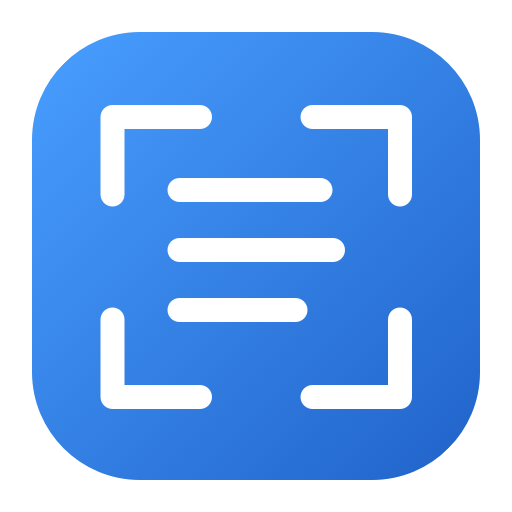

<div align="center">
  

  <h1>Word Snip</h1>

  <p>
    <a href="https://github.com/Ajtn05/Word-Snip/releases/tag/v1.2.0"></a>
    <a href="https://github.com/Ajtn05/Word-Snip/releases/download/v1.2.0/Word-Snip-v1.2-macOS.zip"></a>
    
    
  </p>

  <p>Because my girlfriend wanted to copy text for her flashcards...</p>
  <p><strong>Copy text from anywhere on your Mac with one shortcut.</strong></p>
  <p>Select an area of your screen. Word Snip recognizes the text with Apple Vision and copies it to your clipboard.</p>
</div>

## Capture text from your screen

1. Press **⌃⇧2** or your chosen shortcut.
2. Drag a rectangle around the text you want.
3. Paste the recognized text anywhere. Press **Esc** to cancel a selection.

Word Snip can launch at login and has an optional menu bar icon. **⌃⌥,** opens Settings even when the icon is hidden.

## Download

[Download Word Snip 1.2 for macOS](https://github.com/Ajtn05/Word-Snip/releases/download/v1.2.0/Word-Snip-v1.2-macOS.zip), unzip it, and move `Word Snip.app` to `/Applications` before opening it. The app supports Apple silicon and Intel Macs running macOS 14 or newer.

**This build is development signed and not notarized.** macOS may block its first launch. If you trust the download, try opening the app, then go to **System Settings → Privacy & Security → Open Anyway**. The signing certificate includes the developer's email address.

When prompted, grant **Screen & System Audio Recording** access. Fully quit Word Snip and reopen it after granting access.

## Build from source

Requires macOS 14 or newer, Xcode, and [XcodeGen](https://github.com/yonaskolb/XcodeGen). Before generating the project on another Mac, set `CODE_SIGN_IDENTITY` and `DEVELOPMENT_TEAM` in `project.yml` to your own Apple Development signing identity and team.

```sh
xcodegen generate
xcodebuild -project WordSnip.xcodeproj -scheme WordSnip -configuration Release -destination 'generic/platform=macOS' ARCHS='arm64 x86_64' ONLY_ACTIVE_ARCH=NO build
```

Open `WordSnip.xcodeproj` in Xcode to run or archive the app. Move a built app to `/Applications` before enabling **Launch at login**, so the login item points to a stable location. Consistent signing lets Screen Recording permission persist across builds. Distribution to other Macs with normal Gatekeeper approval requires Developer ID signing and notarization.

## Screen Recording permission

If macOS keeps asking for permission despite the switch being on, confirm that you launched the copy in `/Applications`, quit it, and reopened that same copy. Older Xcode and `dist` builds may appear under the same name in System Settings. Remove stale Word Snip entries there and grant access to the installed copy.
